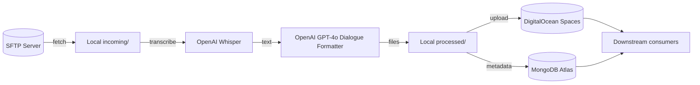

# Audio Pipeline

Production-ready Node.js pipeline that pulls call recordings from SFTP, transcribes with OpenAI, stores outputs in DigitalOcean Spaces, and records metadata in MongoDB.

## Architecture



## Prerequisites
- Node.js 20+
- npm 9+
- Access to SFTP host with WAV/MP3/M4A recordings
- OpenAI API key with Whisper/Chat access
- DigitalOcean Space (S3-compatible) and credentials
- MongoDB Atlas (or compatible) database

## Setup
1. Clone the repository to your pipeline host (local dev or DigitalOcean Droplet).
2. Install dependencies:
   ```bash
   cd /Users/dredog/Desktop/Pipeline~
   npm install
   ```
3. Copy `.env.example` to `.env` (file already tracked locally) and populate with real secrets (see table below).
4. Optional: set log verbosity via `LOG_LEVEL` (`info`, `debug`, `warn`, etc.).

## Environment Variables

| Variable | Required | Description |
| --- | --- | --- |
| `OPENAI_API_KEY` | ✅ | Whisper + GPT-4o access token |
| `SFTP_HOST` | ✅ | SFTP server hostname |
| `SFTP_PORT` | ❌ (default 22) | SFTP port |
| `SFTP_USER` | ✅ | SFTP username |
| `SFTP_PASS` | ✅ | SFTP password |
| `SFTP_REMOTE_PATH` | ✅ | Remote directory root containing recordings |
| `SPACES_KEY` | ✅ | DigitalOcean Spaces access key |
| `SPACES_SECRET` | ✅ | DigitalOcean Spaces secret key |
| `SPACES_REGION` | ✅ | Spaces region (e.g. `sfo3`) |
| `SPACES_BUCKET` | ✅ | Space name |
| `SPACES_ENDPOINT` | ❌ | Custom endpoint URL (https://bucket.region.digitaloceanspaces.com) |
| `SPACES_PREFIX` | ❌ | Optional key prefix inside the bucket |
| `MONGO_URI` | ✅ | MongoDB connection string |
| `DB_NAME` | ❌ (default transcripts) | Mongo database name |
| `COLLECTION_NAME` | ❌ (default calls) | Mongo collection name |
| `PIPELINE_MAX_FILES` | ❌ | Limit files processed per run |
| `SFTP_MAX_FILES` | ❌ | Limit downloads per fetch |
| `LOG_LEVEL` | ❌ (default info) | Pino log level |

The config loader validates all required values on startup. Missing or invalid fields will abort the process with a detailed error report.

## Running Locally

- **Dry run:** limit downloads & processing for smoke tests.
  ```bash
  cd /Users/dredog/Desktop/Pipeline~
  SFTP_MAX_FILES=5 PIPELINE_MAX_FILES=5 node pipeline.js
  ```
- **Full run:** allow env-configured caps to control volume.
  ```bash
  cd /Users/dredog/Desktop/Pipeline~
  node pipeline.js
  ```
- **Utility scripts:**
  - `node check-sftp.js [limit]` – peek at remote directory.
  - `node test-sftp.js` – download using pipeline logic.
  - `node test-upload.js <audio> [transcript]` – push a processed pair to Spaces.

Logs are written via Pino to stdout for easy ingestion by `systemd`, `pm2`, or hosted logging platforms.

## Error Handling & Retries
- All network calls (SFTP connect/list/download, OpenAI transcription and formatting, Spaces uploads, Mongo inserts) use exponential backoff retries with three attempts.
- Failures emit structured logs with `taskName`, attempt count, and delay.
- The pipeline continues to the next file if a single file fails, ensuring partial progress.

## Suggested Tests
- Unit tests (Jest recommendation):
  - `sftp.js`: mock SFTP client list/download behavior and retry scenarios.
  - `transcribe.js`: stub OpenAI client to assert formatting fallback.
  - `storage.js`: mock S3 client to ensure key naming and metadata.
  - `pipeline.js`: inject mocks for modules to verify orchestration & cleanup.
- Integration smoke tests: run pipeline with `PIPELINE_MAX_FILES=1` against staging resources.

## Deployment Guide (DigitalOcean Droplet)
1. **Provision Droplet:** Ubuntu 22.04 LTS, 2GB RAM recommended.
2. **System packages:** `sudo apt update && sudo apt install -y nodejs npm git ufw`.
3. **Clone repo & install:** same steps as local setup.
4. **Secrets:**
   - Store `.env` under `/opt/pipeline/.env` with `chmod 600`.
   - Alternatively, inject via `dotenvx` or DO Secrets Manager.
5. **Process manager:**
   - Option A: `pm2 start pipeline.js --name audio-pipeline --cron "0 * * * *"` for hourly runs.
   - Option B: `systemd` service + timer (see snippet below).
6. **systemd example:**
   ```ini
   # /etc/systemd/system/audio-pipeline.service
   [Unit]
   Description=Audio transcription pipeline

   [Service]
   WorkingDirectory=/opt/pipeline
   EnvironmentFile=/opt/pipeline/.env
   ExecStart=/usr/bin/node pipeline.js
   StandardOutput=append:/var/log/audio-pipeline.log
   StandardError=append:/var/log/audio-pipeline.log

   # /etc/systemd/system/audio-pipeline.timer
   [Unit]
   Description=Run audio pipeline hourly

   [Timer]
   OnBootSec=5m
   OnUnitActiveSec=1h

   [Install]
   WantedBy=timers.target
   ```
   Enable with `sudo systemctl enable --now audio-pipeline.timer`.
7. **Security:**
   - Configure UFW to allow SSH only (`sudo ufw allow OpenSSH`).
   - Rotate API keys regularly.
   - Monitor Droplet metrics and Spaces usage.
8. **Maintenance:**
   - Use `journalctl -u audio-pipeline.service` for logs.
   - Schedule log rotation for `/var/log/audio-pipeline.log` with `logrotate`.

## Troubleshooting
- **Config validation fails:** review the error output for missing env vars.
- **SFTP failures:** ensure host reachable from Droplet, check credentials, confirm remote path exists.
- **OpenAI rate limits:** tune retry backoff or reduce parallelism (pipeline currently processes sequentially).
- **Spaces permission errors:** verify bucket existence and key ACLs.
- **Mongo insert failures:** confirm IP allowlist in Atlas includes Droplet public IP.

## License
Internal project — adapt licensing details as needed.

